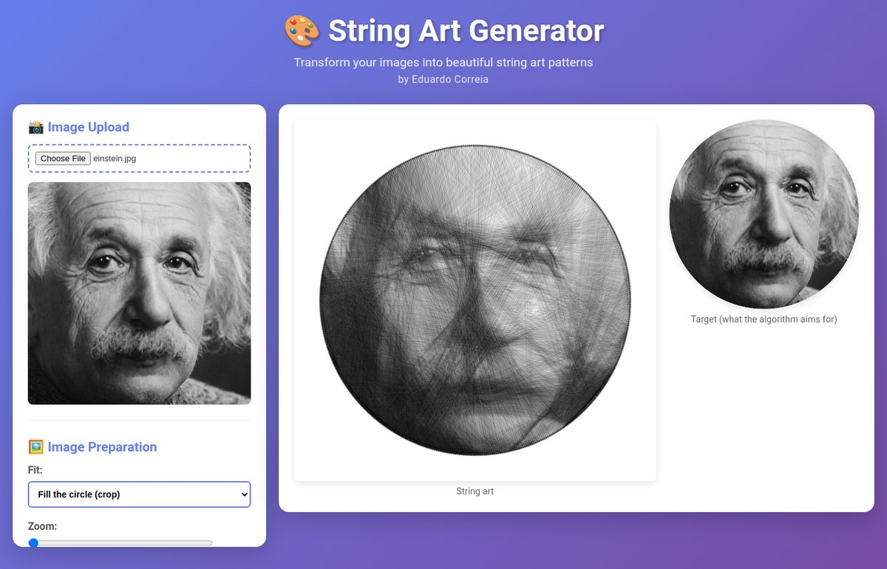
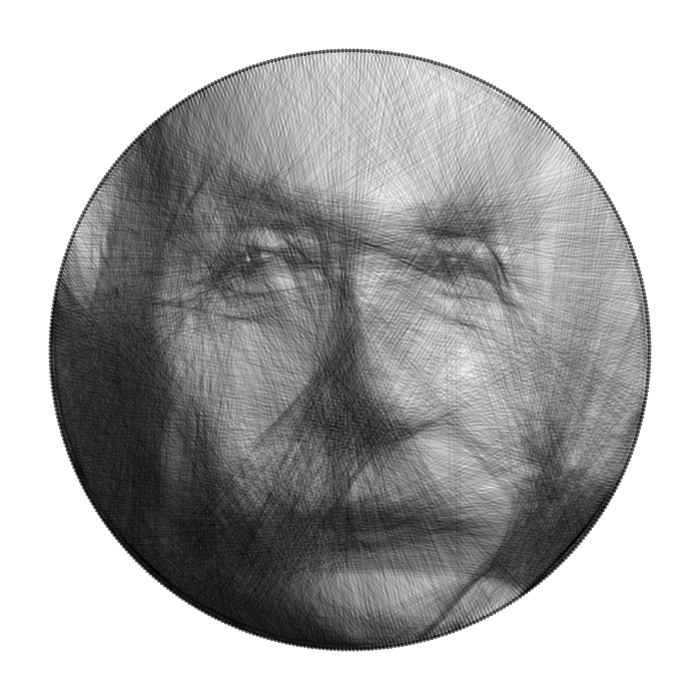

# 🎨 String Art Generator

[](COPYING.LESSER)

A web-based tool that transforms images into string art patterns, with
step-by-step instructions for making them by hand, a printable pin template,
and a JSON export for robot or CNC automation. It runs entirely in the
browser: no server, no build step, and no dependencies.

Copyright (c) 2025-2026 Eduardo Correia <ecorreia@apliant.com.br>



- [Example](#example)
- [Algorithms](#-algorithms)
- [Features](#features)
- [How to use](#how-to-use)
- [Tips for best results](#tips-for-best-results)
- [Creating physical string art](#creating-physical-string-art)
- [Robot automation](#robot-automation)
- [Development](#development)
- [Building and deploying](#building-and-deploying)
- [Documentation](#documentation)
- [Contributing](#contributing)
- [License](#license)

## Example

| Input | Greedy | Radon Transform |
| ----- | ------ | --------------- |
|  |  |  |
| | 500 pins, 5,467 lines, 90.9% match | 500 pins, 4,640 lines, 90.7% match |

These results use the best settings found by testing about 1,700
combinations on this portrait. The settings, with lighter "Balanced" and
"Beginner" alternatives for building by hand, are in
[assets/best-settings.txt](assets/best-settings.txt): load
`assets/einstein.jpg` and try them.

The exported instructions for the Greedy version begin like this:

```text
STRING ART INSTRUCTIONS
=======================
Generated by String Art Generator - (c) Eduardo Correia <ecorreia@apliant.com.br>

ALGORITHM: GREEDY
- Match to target image: 90.9%

SETUP:
- Pin circle diameter: 60.0 cm
- Number of pins: 500 (spaced 3.8 mm apart)
- Nail diameter: 1.5 mm
- Total string connections: 5467
...
STRING SEQUENCE:
1. Pin 0 → Pin 199
2. Pin 199 → Pin 48
3. Pin 48 → Pin 203
```

## ✨ Algorithms

Choose between two algorithms:

### 🎯 Greedy (default)

- Best for portraits and photos
- Produces recognizable, realistic results
- At each step, draws the line that most improves the match with the
  target, and stops by itself when no line would improve it

### 🔬 Radon Transform

- A hybrid that adds Radon projections (the math behind CT scans) to the
  line score
- Favors lines that follow the image's large-scale structure
- Good for logos, geometric shapes, and higher-contrast results

Both algorithms model the canvas exactly: each string is drawn with its real
line weight and opacity, blended the way the browser draws it, so the preview
is a faithful picture of the thread.

📖 See [ALGORITHMS.md](ALGORITHMS.md) for a comparison and
[RADON_EXPLAINED.md](RADON_EXPLAINED.md) for how the Radon mode works.

## Features

### Image preparation

- **Image upload**: any image format your browser can decode
- **Fit**: fill the circle (crop) or fit the whole image
- **Zoom and position** to choose the part of the image that is used
- **Contrast and gamma** adjustments
- **Target preview**: the prepared image, shown next to the result

### Generation

- **Auto-optimize** (Greedy): analyzes the image and suggests parameters
- **Customizable parameters**:
  - Resolution (radius 100-600 pixels)
  - Number of pins (50-500), with pin 0 at 3 o'clock or 12 o'clock
  - String iterations (500-10,000, the maximum number of lines)
  - Line opacity (5-50%) and line weight (0.5-3 px)
  - Minimum pin distance (10-100)
  - Radon only: Radon angles (60-360) and darkness threshold (0-255)
- **Runs in the background** (Web Worker), with a progress bar and a Cancel
  button
- **Match score**: how closely the result matches the target

### Animation and visualization

- **Live preview**: watch the string art being built line by line
- **Speed control**: 1-100 lines per frame
- **Playback controls**: play, pause, reset, and skip to end

### For the physical piece

- **Pin circle diameter** in cm and **nail diameter** in mm, independent of
  the resolution
- String length, including the thread that wraps around each nail, plus 20%
  extra for knots and waste
- Pin spacing, estimated work time (with fatigue and breaks), and
  recommended work sessions

### Export options

1. **Text instructions**: pin positions with angles, the full connection
   sequence, materials, and time estimates
2. **JSON**: pin coordinates in pixels and millimeters, the connection
   sequence, and metadata, for robots and scripts
3. **Image**: the finished result as a PNG
4. **Pin template**: a full-size SVG to print and tape onto the board

Downloads are named after the uploaded image, and your settings are
remembered between visits.

## How to use

1. **Open** `index.html` in a modern web browser (or run `npm start`; see
   [QUICKSTART.md](QUICKSTART.md)).
2. **Upload** an image.
3. **Prepare** it if needed: crop, zoom, position, contrast, and gamma. The
   target preview shows what the algorithm will aim for.
4. **Adjust** the parameters, or tick *Auto-Optimize Parameters*:
   - More pins = finer detail
   - More iterations = darker, more detailed result
   - Lower opacity = lighter, more delicate look
5. Set the **pin circle diameter** and **nail diameter** of your board.
6. Click **Generate String Art**. You can cancel a long run.
7. **Watch** the animation or skip to the end.
8. **Export** the instructions, the JSON, the image, or the pin template.

## Tips for best results

- **High-contrast images** work best (portraits, silhouettes).
- **Simple subjects** are more recognizable than busy scenes.
- **Crop tightly** around the subject with the zoom and position controls.
- **Start small**: try 200 pins and 2000 iterations first, then the
  settings in [assets/best-settings.txt](assets/best-settings.txt).
- **Compare settings** with the match score.
- See [QUICKSTART.md](QUICKSTART.md) for suggested settings per algorithm.

## Creating physical string art

1. **Materials**:
   - A board larger than the pin circle
   - Small nails or pins (one per pin in the export)
   - Thread or string (black works well)
2. **Setup**:
   - Download the **pin template**, print it at 100% scale (check it with its
     100 mm scale bar), and tape it to the board. Large boards need poster
     printing or tiling.
   - Hammer a nail through each dot. Pin 0 is marked in red, and pins are
     numbered clockwise.
   - Without a template, mark each pin using the angles listed in the
     exported instructions.
3. **Execution**:
   - Follow the exported sequence, wrapping the string around each pin in
     order.
   - Don't cut the string: it's one continuous thread!

## Robot automation

The JSON export contains everything a machine needs: pin coordinates relative
to the circle center (x to the right, y down) in pixels and in millimeters,
the connection sequence, and metadata.

```json
{
  "metadata": {
    "generated": "2026-01-01T12:00:00.000Z",
    "type": "string_art",
    "version": "1.1",
    "algorithm": "greedy",
    "generator": "String Art Generator",
    "author": "Eduardo Correia <ecorreia@apliant.com.br>",
    "license": "LGPL-3.0-or-later",
    "pin0Position": "3 o'clock",
    "coordinateSystem": "origin at circle center, x right, y down; x/y in pixels, xMm/yMm in millimeters"
  },
  "parameters": { "algorithm": "greedy", "radius": 300, "numPins": 500, "...": "..." },
  "physicalDimensions": { "pinCircleDiameterCm": 60, "pinSpacingMm": 3.77, "nailDiameterMm": 1.5, "...": "..." },
  "materials": { "stringLengthMeters": 2430.94, "...": "..." },
  "timeEstimates": { "workTimeMinutes": 1903, "...": "..." },
  "pins": [
    { "index": 0, "x": 299.5, "y": 0, "xMm": 300, "yMm": 0, "angle": 0 }
  ],
  "sequence": [
    { "from": 0, "to": 199 }
  ],
  "statistics": { "totalConnections": 5467, "uniquePinsUsed": 500, "matchPercent": 90.9 }
}
```

Version 1.1 only adds fields to version 1.0, so existing readers keep
working.

## Development

You need a browser, and Node.js 18 or newer for the scripts. There are no
npm dependencies to install.

```bash
npm start          # serve the app on http://localhost:8080
npm test           # run the tests
npm run check      # syntax-check the scripts
npm run build      # build dist/
```

| File | Purpose |
| ---- | ------- |
| `index.html`, `style.css` | Page layout, controls, and styles |
| `stringart-core.js` | Algorithms, statistics, and export formats. No DOM access; runs in the page, in a Web Worker, and in Node |
| `script.js` | User interface: controls, image preparation, animation, downloads |
| `tests/` | Node tests for `stringart-core.js` |
| `assets/` | Example portrait, its string art results, and the best settings found for it |
| `build.js`, `serve.js` | Build script and local web server |

See [CONTRIBUTING.md](CONTRIBUTING.md) for more.

## Building and deploying

The source files run as they are. To produce a single self-contained HTML
file for hosting:

```bash
npm run build          # or ./build_dist.sh, or node build.js
```

This writes `dist/`, which is not tracked in git. See
[BUILD_GUIDE.md](BUILD_GUIDE.md) for details and deployment options.

## Documentation

| Document | Contents |
| -------- | -------- |
| [QUICKSTART.md](QUICKSTART.md) | Getting it running, which algorithm to use, suggested settings |
| [ALGORITHMS.md](ALGORITHMS.md) | How both algorithms work and how they compare |
| [RADON_EXPLAINED.md](RADON_EXPLAINED.md) | The hybrid Radon mode in detail |
| [FEATURES.md](FEATURES.md) | Complete feature list |
| [BUILD_GUIDE.md](BUILD_GUIDE.md) | Building and deploying |
| [CONTRIBUTING.md](CONTRIBUTING.md) | How to contribute |

## Browser compatibility

- Chrome/Edge: ✅ Full support
- Firefox: ✅ Full support
- Safari: ✅ Full support
- Mobile browsers: ✅ Supported (slower with many pins or iterations)

## Contributing

Bug reports, documentation fixes, and code are welcome. Report bugs and
suggest features in the [issue tracker](https://github.com/99ecarvalho/StringArt2/issues),
and please read [CONTRIBUTING.md](CONTRIBUTING.md) before opening a pull request.

## License

Copyright (c) 2025-2026 Eduardo Correia <ecorreia@apliant.com.br>

String Art Generator is free software: you can redistribute it and/or modify
it under the terms of the **GNU Lesser General Public License, version 3 or
(at your option) any later version**. The license text is in
[COPYING.LESSER](COPYING.LESSER); it supplements the GNU General Public
License v3, included as [COPYING](COPYING).

This program is distributed in the hope that it will be useful, but WITHOUT
ANY WARRANTY; without even the implied warranty of MERCHANTABILITY or FITNESS
FOR A PARTICULAR PURPOSE.

Images you create with the tool, and the instructions and JSON it exports for
them, are yours; the license covers the software, not its output.

The example portrait in `assets/einstein.jpg` is Albert Einstein, photographed
in 1947 by Orren Jack Turner. It is in the public domain in the United States
(published 1931-1963, copyright not renewed); source:
[Wikimedia Commons](https://commons.wikimedia.org/wiki/File:Albert_Einstein_Head.jpg).
It was cropped and resized for this project.

---

Enjoy creating beautiful string art! 🧵✨
